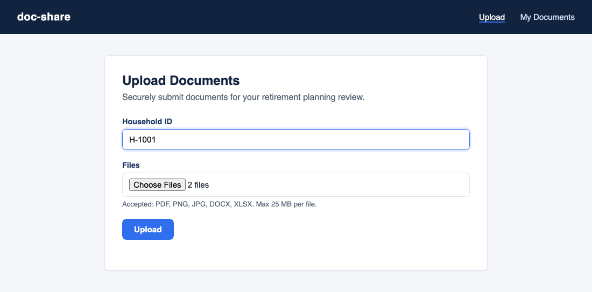
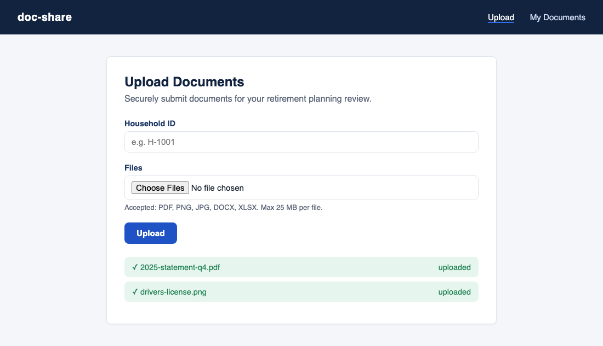
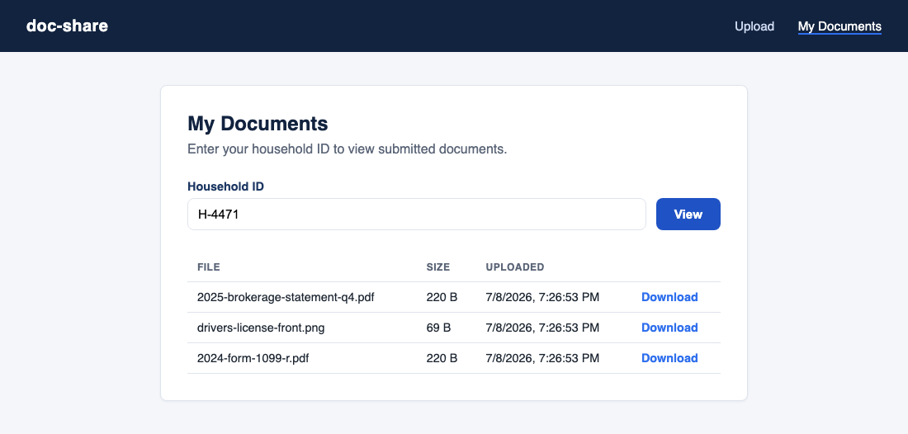
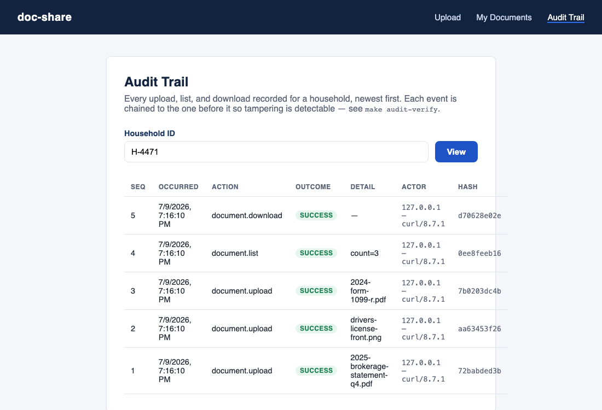

# doc-share

Sharing Client Financial Documents

An MVP portal that lets a financial advisor's clients upload documents (statements, tax forms, IDs, etc.) needed to set up a retirement plan. Clients identify themselves with a **household ID**; uploads and lookups are scoped to that ID. No login is required for this MVP.

## The 60-second pitch

"Let clients send us documents" sounds like a simple ask — until it turns into a six-month platform project. This MVP proves that's a false choice. It's the whole workflow — **upload, store, index, retrieve** — running end-to-end, built in a single engineering session on three boring, battle-tested pieces of technology:

| Layer | Choice | Why it's the boring choice |
|---|---|---|
| API | FastAPI | Thin, typed, fast to iterate on |
| Object storage | MinIO (S3 API) | Same API as AWS S3 — swap providers later without touching a line of app code |
| Metadata | Postgres | The most well-understood relational database there is |

No custom file-handling framework, no bespoke storage layer, no premature microservices. That's the point: **the fastest way to de-risk a document-collection feature is to build the real thing on top of standard infrastructure, not to build a platform to build it on.**

**What this de-risks for the business, today:**
- The core client workflow (upload → confirmation → retrieval) is real and demoable, not a mockup.
- The data model (documents scoped to a household) is the actual shape this needs to take in production — extending it later is additive, not a rewrite.
- The storage choice (S3-compatible) means "point it at AWS instead of MinIO" is a config change, not a migration project.

**What's intentionally deferred — by design, not oversight:**
Client authentication, virus scanning, and per-advisor access control are the next increment, not a hidden gap. See [Out of scope for this MVP](#out-of-scope-for-this-mvp) below for the specific, named punch list. Calling this out explicitly is what makes it safe to demo now and harden deliberately before real client data ever touches it.

**The takeaway for tech leadership:** this is what "build the MVP, not the platform" looks like in practice — a working feature in days, a clear list of what's left before production, and an architecture that doesn't have to be thrown away to get there.

## Screenshots

**Uploading documents** — a client enters their household ID, picks one or more files, and gets a per-file acknowledgement back:

| Before submit | After submit |
|---|---|
|  |  |

**Reviewing what's on file** — the same household ID looks up everything submitted so far, newest first, each with a download link:



**Reviewing the audit trail** — the same household ID pulls up every logged action (upload, list, download), each row chained to the one before it via its hash:



## Architecture

- **Frontend:** static HTML/CSS/vanilla JS (`frontend/`) served by FastAPI — an upload page, a documents list page, and an audit trail page.
- **Backend:** FastAPI (`app/`), SQLAlchemy 2.0 + Alembic migrations against Postgres, boto3 against MinIO (S3-compatible object storage).
- **Storage model:** each uploaded file is written to MinIO under `{household_id}/{uuid}-{filename}`; a row referencing it is written to the `documents` table in Postgres.
- **Orchestration:** `docker compose` runs Postgres and MinIO (plus a one-shot bucket-creation step) for local dev. The API itself runs directly on the host via `uv run uvicorn`, not in a container.

## Running locally

```
cp .env.example .env
make up      # starts Postgres + MinIO in docker
make dev     # runs migrations, then starts the API on the host with autoreload
```

Then open:
- `http://localhost:8000/upload.html` — upload documents for a household
- `http://localhost:8000/documents.html` — list/download a household's documents
- `http://localhost:8000/audit.html` — view a household's audit trail (see [Audit trail](#audit-trail-sec-17a-4-audit-trail-alternative))
- `http://localhost:9001` — MinIO console (login with the `MINIO_ROOT_USER`/`PASSWORD` from `.env`)

Run `make` (no target) or open the `Makefile` for the full list of commands (`migrate`, `revision`, `psql`, `logs`, `clean`, ...).

## What gets stored in the database

Postgres never holds file bytes — only one row per uploaded file in the `documents` table, pointing at where the actual object lives in MinIO:

| Column | Type | Example | Notes |
|---|---|---|---|
| `id` | UUID (PK) | `f9d4ffbd-2a9c-...` | server-generated via `gen_random_uuid()` |
| `household_id` | text, indexed | `H-4471` | the scoping key for every read/write |
| `original_filename` | text | `2025-brokerage-statement-q4.pdf` | as submitted by the client, unmodified |
| `content_type` | text | `application/pdf` | validated against the allowlist before storage |
| `size_bytes` | bigint | `220` | validated against the 25 MB cap before storage |
| `bucket` | text | `doc-share` | which MinIO bucket the object lives in |
| `object_key` | text | `H-4471/f9d4ffbd-.../2025-brokerage-statement-q4.pdf` | the MinIO key; combined with `bucket`, this is what a presigned download URL resolves |
| `uploaded_at` | timestamptz | `2026-07-09 00:26:53+00` | server-generated via `now()` |

The file itself is written to MinIO under `object_key`; the row above is only ever created after that upload succeeds, so a `documents` row is a guarantee the bytes exist in object storage. Downloads never proxy through Postgres or read the file into the API process — `GET /api/documents/{id}/download` looks up the row, then 302-redirects the browser straight to a short-lived presigned MinIO URL.

## Audit trail (SEC 17a-4 audit-trail alternative)

Financial advisors are typically subject to **SEC Rule 17a-4** (via FINRA Rule 4511), which historically required client records to be kept in **WORM** (write-once, read-many) storage. A **2023 amendment** (effective January 3, 2023; compliance date May 3, 2023) added an **audit-trail alternative**: records can live on ordinary systems instead of physically immutable storage, provided the firm maintains a complete, time-stamped audit trail of every create/modify/delete action — who did it, when, and with enough integrity guarantees that tampering is detectable.

This app implements that alternative rather than true WORM:

- **`audit_events` table** — one append-only row per action: `document.upload`, `document.upload_rejected` (failed validation or storage error), `document.list`, `document.download`, and `document.download_not_found`. No code path ever `UPDATE`s or `DELETE`s a row.
- **Hash chain for tamper-evidence** — each row stores a SHA-256 `hash` computed over its own contents plus the previous row's hash (`prev_hash`). Altering, deleting, or reordering any historical row breaks the chain from that point forward. Run `make audit-verify` to walk the whole chain and confirm it's intact (or see exactly where it isn't):
  ```
  $ make audit-verify
  OK — 6 events, chain intact
  ```
  If a row is ever modified directly in the database, the same command reports it: `TAMPER DETECTED at seq 2: hash mismatch at seq 2 (row contents modified after creation)` and exits non-zero — suitable for a CI/ops check.
- **Producing the trail** — `GET /api/audit?household_id=` returns a household's full trail (newest first) as JSON, including every field needed to re-verify it independently: `seq`, `occurred_at`, `action`, `document_id`, `object_key`, `actor_ip`, `actor_user_agent`, `outcome`, `detail`, `prev_hash`, `hash`. The `audit.html` page (see [Screenshots](#screenshots)) is a thin read-only view over the same endpoint, for a human to review a household's trail without calling the API directly.
- **Fail-closed by default** — for read actions (list/download), if the audit write itself fails, the request fails rather than silently serving an unlogged access. This is controlled by `AUDIT_FAIL_CLOSED` in `.env` (default `true`); setting it `false` fails open (serves the response, logs a warning) instead.

**Honest limitations, stated rather than papered over:**
- **No authenticated operator.** This MVP has no login, so there's no verified "individual" to attribute actions to. The audit trail captures the best available signals instead — the client-supplied `household_id` (an **untrusted claim**, not a verified identity) plus network identity (`actor_ip`, `actor_user_agent`). Closing this gap requires the authentication work already called out in [Out of scope](#out-of-scope-for-this-mvp).
- **No modify/delete of documents yet.** Uploads are append-only — there's no edit or delete endpoint — so today's trail only ever needs to prove *creation and access* happened, not reconstruct edit history. The schema and hash chain are already shaped to carry modify/delete events the moment such an endpoint exists.
- **This is a broker-dealer-flavored rule.** 17a-4/FINRA 4511 govern broker-dealers; a pure RIA is governed by the more technology-neutral Advisers Act Rule 204-2, which never mandated WORM in the first place. Confirm which regulatory regime actually applies to the advisor's business before treating this as a compliance checkbox rather than a best practice.
- **Tamper-evident, not tamper-proof.** The hash chain detects after-the-fact tampering; it doesn't prevent someone with direct database access from editing rows (they just can't do it undetectably). The underlying storage is ordinary Postgres, not physically WORM media.

## Upload rules

- Allowed types: PDF, PNG, JPG, DOCX, XLSX.
- Max size: 25 MB per file.

## Out of scope for this MVP

Authentication (and with it, a true per-operator identity for the audit trail — see [Audit trail](#audit-trail-sec-17a-4-audit-trail-alternative)), virus scanning, per-advisor access control, and encryption-at-rest key management are not implemented. Given the sensitivity of client financial documents, these should be addressed before any production use.
